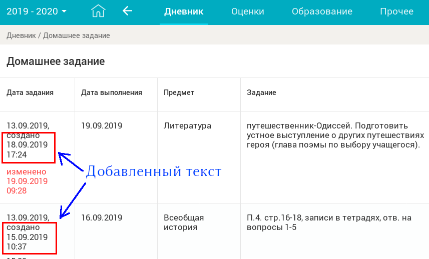

# Firefox addon : ЭЖД - время домашки
Электронный Журнал и Дневник: время создания домашнего задания.

Это расширение предназначено для использования на сайте [ЭЖД](https://dnevnik.mos.ru) ---
электронного дневника, используемого в московских городских школах.

Расширение предоставляет дополнительную информацию о домашнем задании: время
создания домашнего задания отображается в первой графе рядом
с датой, когда это ДЗ было задано.

## Как это выглядит

## Инструкция по установке
Расширение предназначено для установки в браузер Firefox версии не ниже 57.

[Скачайте](https://github.com/olekhov/ejd-homework-time/releases/download/v1.0/ejd_homework_time-1.0-an+fx.xpi),
браузер попросит подверждение установки; расширение установится автоматически.

